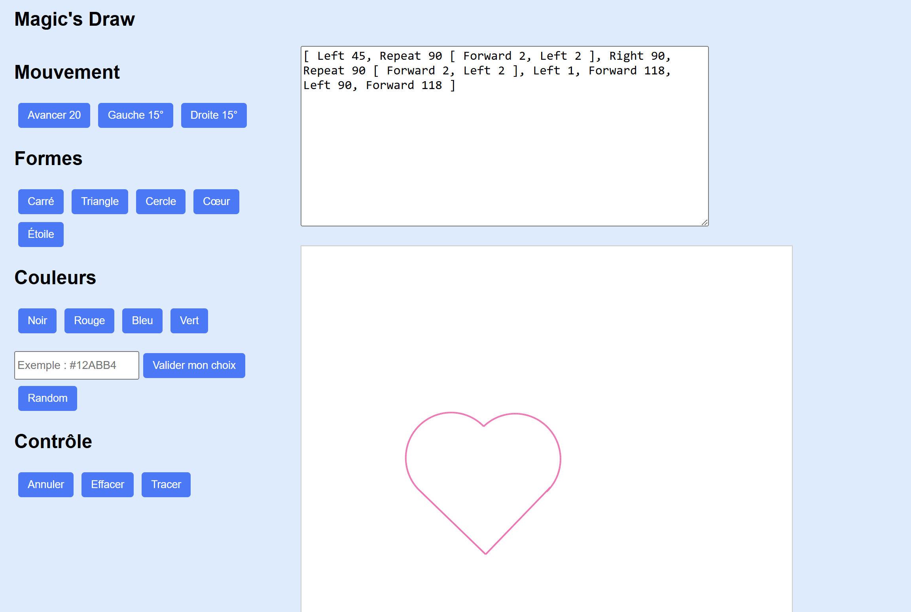

# Magic's Draw — Interpréteur TcTurtle
## Interface graphique TC-Turtle 

## Structure du Projet
Voici les fichiers qui composent notre projet: 
- Main.elm : Cœur de l'application (Modèle, Update, Vue).
- ParserTcTurtle.elm : Analyseur syntaxique utilisant le package elm/parser.
- Drawing.elm : Moteur de rendu calculant les segments et les limites du dessin.

